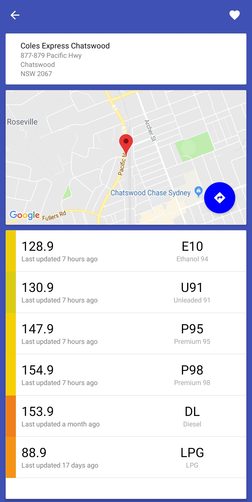
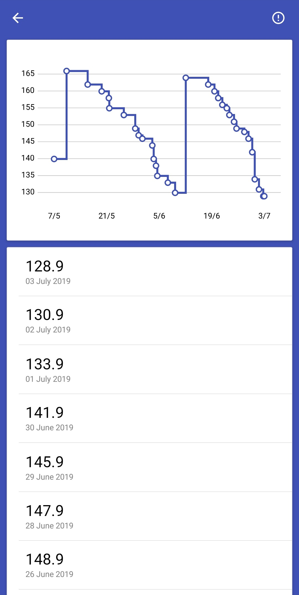

# Petrol Patrol

Petrol Patrol helps users save money by displaying real-time petrol prices across all of NSW, so you can get the best savings every time you fill up your vehicle.

This app is ad-free and is sourced from the NSW Fuelcheck API and NRMA.

Features:
- All prices are available on a map for you to find the cheapest and closest fuel to you
- Identify current trends in the market with graphical charts and price analysis from NRMA so you can time when to fill up
- Examine a station in detail by viewing all of their prices currently on offer and their gain insight into their price cycle
- Bookmark your favourite petrol stations to a favourites list for quick access

