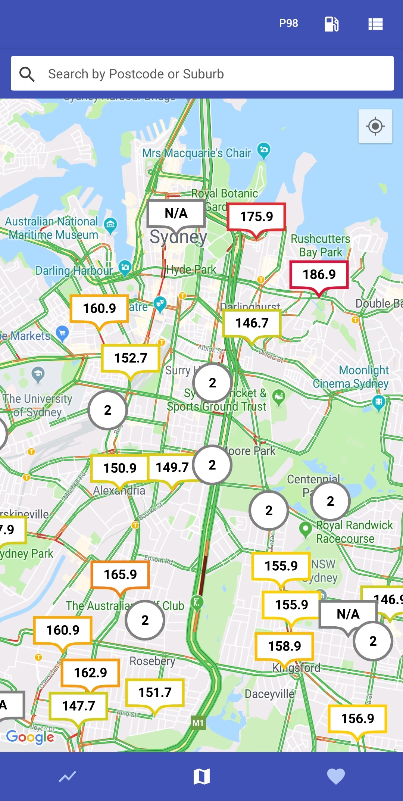

# Petrol Patrol

Petrol Patrol helps you save money by displaying real-time petrol prices across all of NSW, so you can get the best savings every time you fill up your vehicle.

This app is ad-free and is sourced from the NSW Fuelcheck API.

Find all the nearest petrol stations and their current prices on a map based view to help decide which is the best one for you.

See the current market trends and identify trends in fuel prices with graphical charts and price analyses to find the best time to fill up.

Examine each station in detail by viewing all of the prices currently on offer.

Identify station specific trends with a historical timeline view for each price.